## 实验九：入侵检测-Snort

### 实验目的

基于snort工具体验入侵检测，通过配置snort不同规则来进行网络入侵检测

### 实验环境

- VirtualBox-6.1.26
- Attacker：kali-2021.2
- Victim：kali-2021.2
- Gateway：Debian10

### 实验要求

1. 配置snort为嗅探模式
2. 配置并启用snort内置规则
3. 自定义snort规则
4. 和防火墙联动

### 实验过程

#### 网络拓扑


#### 实验一：配置snort为嗅探模式

- 安装snort

  ```shell
  # 禁止在apt安装时弹出交互式配置界面
  export DEBIAN_FRONTEND=noninteractive
  
  apt install snort
  ```

- 配置snort为嗅探模式

  ```shell
  # 开启嗅探模式后从靶机发送数据包
  
  # 显示IP/TCP/UDP/ICMP头
  snort –v
  
  # 终止发包后Ctrl+C退出嗅探模式，会显示头信息
  ```

  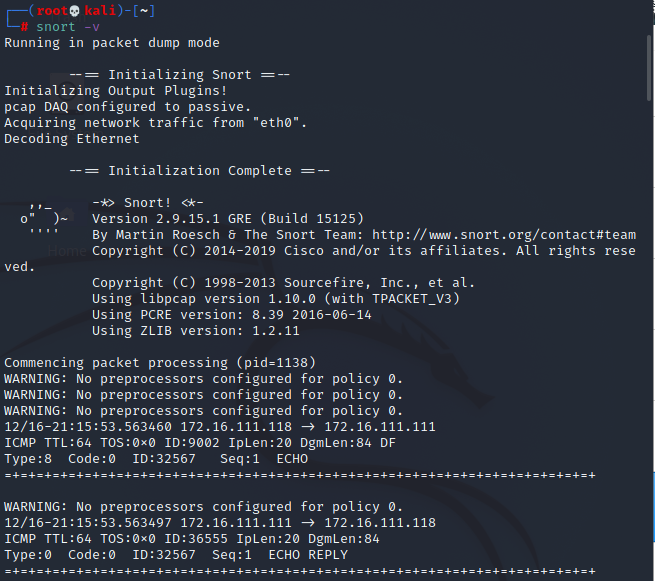

  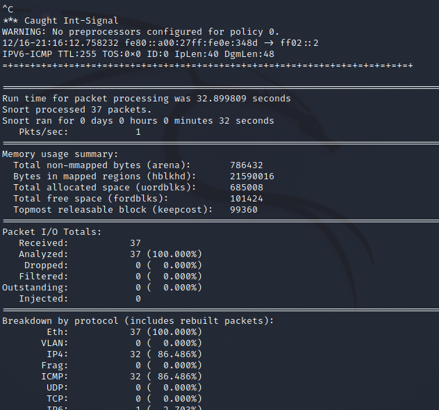

  ```shell
  # 显示应用层数据
  snort -vd
  ```

  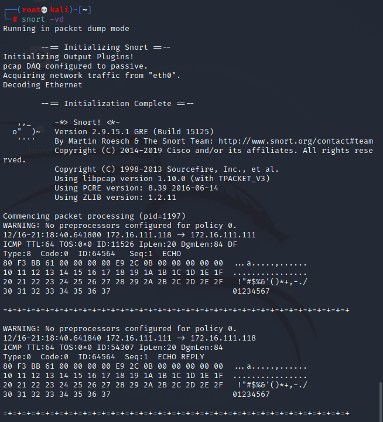

  ```shell
  # 显示数据链路层报文头
  snort -vde
  ```

  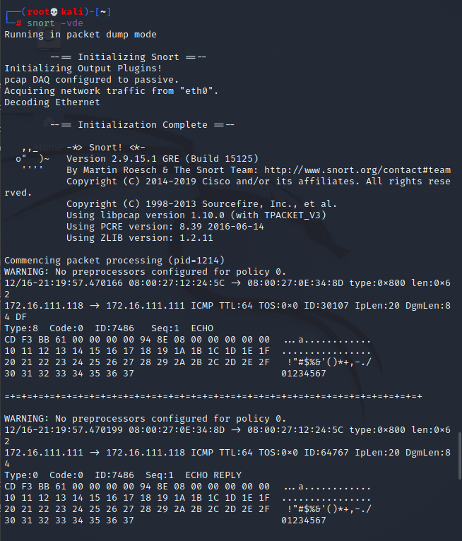

  ```shell
  # -b 参数表示报文存储格式为 tcpdump 格式文件
  # -q 静默操作，不显示版本欢迎信息和初始化信息
  snort -q -v -b -i eth1 "port not 22"
  
  # 嗅探到的数据包会保存在 /var/log/snort/snort.log.<epoch timestamp>
  date -d @<epoch timestamp> # 转换成可读的时间格式
  ```

  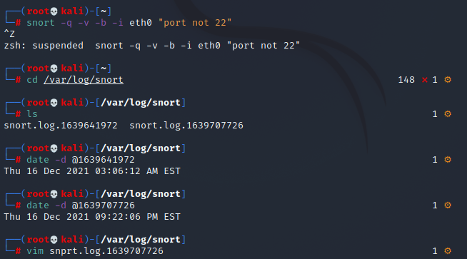

#### 实验二：配置并启用snort内置规则

- 定义`HOME_NET`和`EXTERNAL_NET`

  ```shell
  vim /etc/snort/snort.conf
  ```

  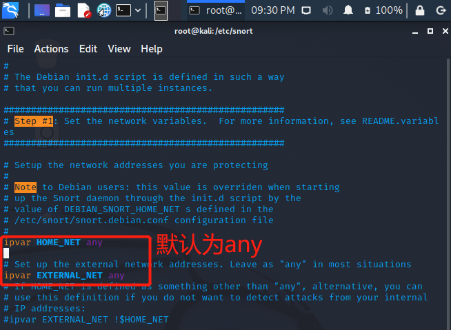

- 启用内置规则

  ```shell
  snort -q -A console -b -i eth0 -c /etc/snort/snort.conf -l /var/log/snort/
  ```

#### 实验三：自定义snort规则

- 新建规则文件

  ```shell
  cat << EOF > /etc/snort/rules/cnss.rules # 新建文件
  alert tcp \$EXTERNAL_NET any -> \$HTTP_SERVERS 80 (msg:"Access Violation has been detected on /etc/passwd ";flags: A+; content:"/etc/passwd"; nocase;sid:1000001; rev:1;)
  alert tcp \$EXTERNAL_NET any -> \$HTTP_SERVERS 80 (msg:"Possible too many connections toward my http server"; threshold:type threshold, track by_src, count 100, seconds 2; classtype:attempted-dos; sid:1000002; rev:1;) # 写入内容
  EOF
  ```

  > 使attacker对一定数量的http请求发出警报

  *检查文件写入结果

  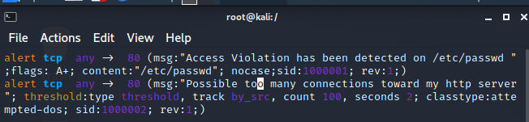

- 将自定义规则文件放入配置文件`snort.conf`中

  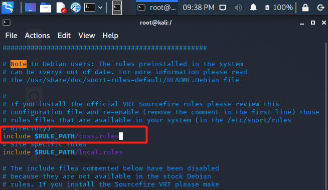

- 启用规则并开启嗅探

  ```shell
  snort -q -A fast -b -i eth1 -c /etc/snort/snort.conf -l /var/log/snort/
  ```

- 使用ab命令进行测试

  ```shell
  ab -c 100 -n 10000 http://172.16.111.111/hello
  ```

- 结果：生成警报，配置生效

  

#### 实验四：和防火墙联动

- 下载并安装[guardian.tar.gz](https://c4pr1c3.github.io/cuc-ns/chap0x09/attach/guardian.tar.gz)

  ```shell
  # 解压缩 Guardian-1.7.tar.gz
  tar zxf guardian.tar.gz
  
  # 安装 Guardian 的依赖 lib
  apt install libperl4-corelibs-perl
  ```

  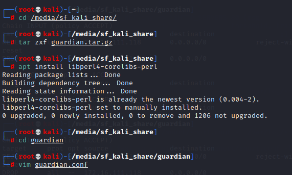

- 修改`guardian.conf`参数

  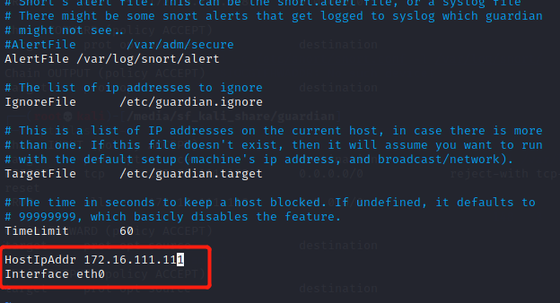

- 开启snort

  ```shell
  snort -q -A fast -b -i eth1 -c /etc/snort/snort.conf -l /var/log/snort/
  ```

  启动`guardian.pl`

  ```shell
  perl guardian.pl -c guardian.conf
  ```

  在另一台主机用`nmap`

  ```shell
  nmap 192.168.56.107 -A -T4 -n -vv
  ```

  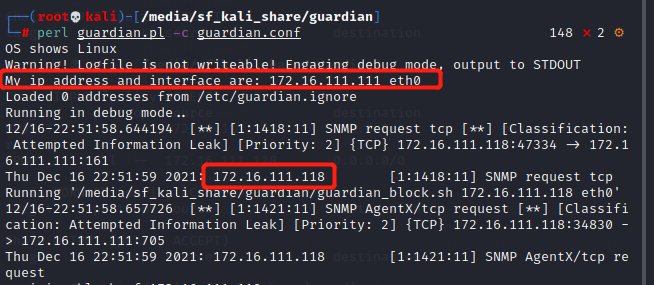

- 查看此时防火墙的链

  > guardian.conf 中默认的来源IP被屏蔽时间是 60 秒，在一分钟之后会更新iptable的规则会被删除

  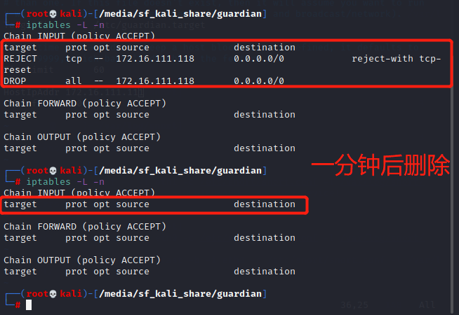

  由此可知，在nmap暴力扫描过程中，靶机上的`iptables`添加了拒绝和丢弃的规则，至一段时间（60s）后规则被删除

### 实验思考

- IDS与防火墙的联动防御方式相比IPS方式防御存在哪些缺陷？是否存在相比较而言的优势？
  - 二者都是网络基础架构的一部分，将网络数据包与包含已知网络攻击签名的网络威胁数据库进行比较，标记匹配的数据包；
  - 二者之间的主要区别为，IDS是监视系统，进行主动防御，而IPS是控制系统，进行被动防御
  - IDS部更改网络数据包，但IPS会根据数据包的内容阻止数据包的传递，与防火墙资助IP地址通信一样

### 参考资料

- [谌谌师姐的实验记录](https://blog.csdn.net/lemonalla/article/details/105592309?spm=1001.2014.3001.5501)
- [网络入侵检测--Snort软件配置文件snort.conf详解](https://blog.csdn.net/baidu_19348579/article/details/121337818)

- [课本](https://c4pr1c3.github.io/cuc-ns/chap0x09/exp.html)

