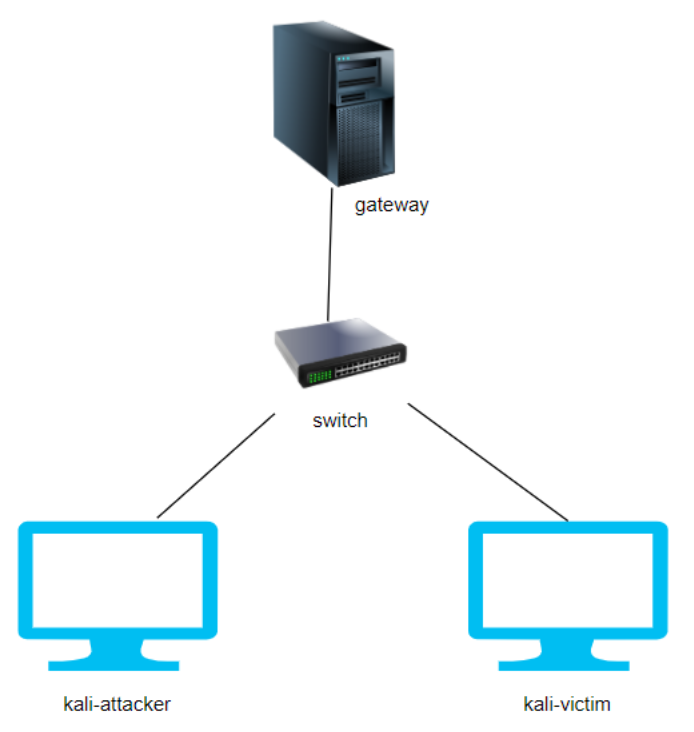
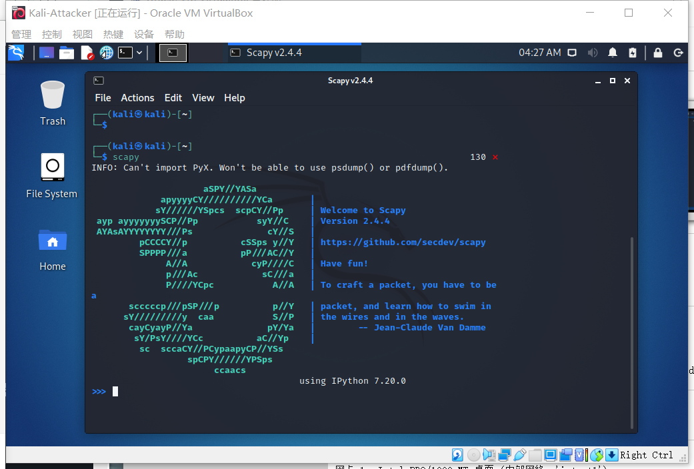

## 实验四：网络监听

### 实验目的

- 了解ARP投毒的过程
- 熟悉scapy的使用

### 实验环境

- VirtualBox-6.1.26
- 攻击者主机（Attacker）：Kali-2021.2
- 受害者主机（Victim）：Kali-2021.2
- 网关（Gateway）：Debian10

### 实验要求

- 至少使用三台机器，连接在同一个内部网络中

  **网络拓扑**

  **节点信息**

  |    ID    | IP Address     | MAC Address       |
  | :------: | -------------- | ----------------- |
  | Gateway  | 172.16.111.1   | 08:00:27:2a:5d:5c |
  | Attacker | 172.16.111.111 | 08:00:27:0e:34:8d |
  |  Victim  | 172.16.111.137 | 08:00:27:9c:cc:5b |

### 实验过程

- 安装scapy

  在Attacker中安装scapy（kali自带，可以直接运行）

  

#### 实验一：检测局域网中的异常中断

- 在受害者主机上检查网卡的混杂模式是否启用

  `ip link show eth0`

  

- 在攻击者上打开scapy，输入以下命令

  `pkt = promiscping("172.16.111.137") `

  无法执行

  

  权限不足，`exit`退出scapy后，sudo重启并运行命令

  

- 回到受害者主机上开启网卡的混杂模式

  `sudo ip link set eth0 promisc on`

  再次检查混杂模式

  `ip link show eth0`

  

  输出结果多了`PROMISC`选项，即开启了混杂模式

- 在攻击者scapy继续执行命令，并观察两次输出的差异

  

  发现在受害者开启混杂模式后，攻击者检测到了受害者混杂模式的开启

- 在受害者主机上手动关闭混杂模式

  `sudo ip link set eth0 promisc off`

#### 实验二：手工单步“毒化”目标主机的ARP缓存

