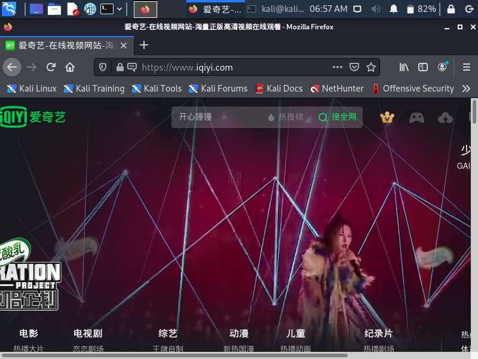
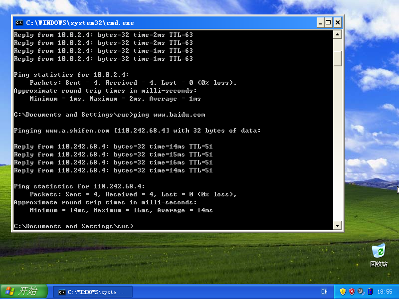
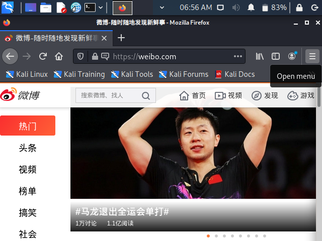
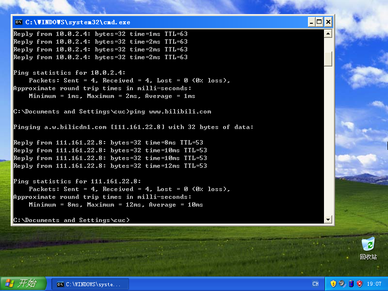

## 实验一：基于 VirtualBox 的网络攻防基础环境搭建

### 实验目的

- 掌握 VirtualBox 虚拟机的安装与使用；
- 掌握 VirtualBox 的虚拟网络类型和按需配置；
- 掌握 VirtualBox 的虚拟硬盘多重加载；

### 实验环境

- VirtualBox虚拟机
- 攻击者主机（Attacker）：Kali Rolling 2109.2
- 网关（Gateway，GW）：Debian Buster
- 靶机（Victim）：xp-sp3 / Kali

### 实验要求

- 虚拟硬盘配置成多重加载

- 搭建满足如下拓扑图所示的虚拟机网络拓扑

  

- 完成网络连通性测试

### 实验结果

- 虚拟硬盘配置成多重加载

  

- 搭建虚拟机网络拓扑

  | 主机名称       | IP地址         |
  | -------------- | -------------- |
  | Kali-Attacker  | 10.0.2.4       |
  | Debian-Gateway | 192.168.57.101 |
  | Victim-XP-1    | 172.16.111.103 |
  | Victim-Kali-1  | 172.16.111.111 |
  | Victim-XP-2    | 172.16.222.110 |

- 完成以下网络连通性测试：

  - [x] 靶机可以直接访问攻击者主机

    

    

    

  - [x] 攻击者主机无法直接访问靶机

    

    

  - [x] 网关可以直接访问攻击者主机和靶机

    

    

  - [x] 靶机的所有对外上下行流量必须经过网关

    

    

    

  - [x] 所有节点均可以访问互联网

<<<<<<< HEAD
    攻击者浏览器访问爱奇艺

    
    
    靶机XP1ping百度

=======
    攻击者浏览器访问爱奇艺

    靶机XP1ping百度
    
    靶机Kali1浏览器访问微博

>>>>>>> 6f1cdd9b65eb837bd7c8d032c54fba09ffdff772

    
    
    靶机Kali1浏览器访问微博
    
    
    
    靶机XP2pingB站
    
    

### 解决问题

- 导入ova失败，报错无详细信息，是镜像包下载不完整，重新下载后解决

- 

  首次pingXP时ping不通，关闭防火墙后解决

### 参考资料

/- [网络安全（2021）p12](https://www.bilibili.com/video/BV1CL41147vX?p=12)

/- [基于 VirtualBox 的网络攻防基础环境搭建](https://c4pr1c3.github.io/cuc-ns/chap0x01/exp.html#)

---

### 课后思考

1. 以下⾏为分别破坏了CIA和AAA中哪⼀个属性或多个属性？

   - 小明抄小强的作业

     CIA：机密性；AAA：认证、授权

   - 小明把小强的系统折腾死机了

     CIA：可用性；AAA：授权

   - 小明修改了小强的淘宝订单

     CIA：完整性、机密性；AAA：认证、授权

   - 小明冒充小强的信用卡账单签名

     CIA：完整性；AAA：认证、授权

   - 小明把自⼰电脑的IP修改为小强电脑的IP，导致小强的电脑⽆法上⽹

     CIA：可用性；AAA：认证、授权

2. 有⼀次，小明⼝袋里有100元，因为打瞌睡，被小偷偷⾛了，搞得晚上没饭吃。又⼀天，小明⼝袋里有200元，这次小明为了防范小偷，不打瞌睡了，但却被强盗持⼑威胁抢⾛了，搞得⼀天没饭吃，小明当天就报警了。

   - 试分析两次失窃事件中的：风险、资产、威胁、弱点、攻击、影响

     | 事件   | 风险 | 资产  | 威胁 | 弱点     | 攻击     | 影响   |
     | ------ | ---- | ----- | ---- | -------- | -------- | ------ |
     | 第一次 | 失窃 | 100元 | 小偷 | 犯困     | 行窃     | 没饭吃 |
     | 第二次 | 抢劫 | 200元 | 强盗 | 无法防卫 | 持刀威胁 | 没饭吃 |
